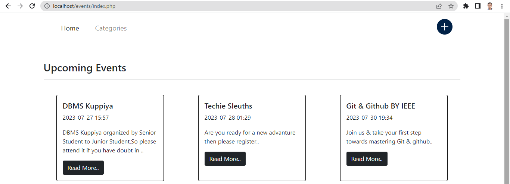
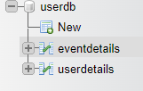
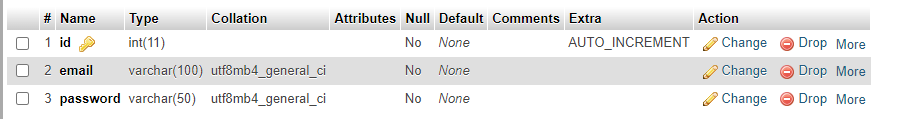
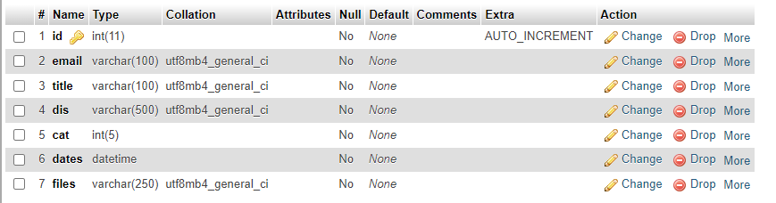

# Event

The Event Website is a simple and user-friendly platform that allows users to organize, manage, and promote events. Whether you're planning a conference, workshop,Club Event,Sport Event or any other event, this website has got you covered. 

## Features

- **Create Events:** Organizers can easily create new events by providing event details, such as title, date, time, location, description, and event category.
- **Filter Events:** Users can search for events based on categories & date.

## Tech Stack

The Event Website is built using the following technologies:

- **Frontend:** HTML , CSS , JavaScript , Bootstrap 5 & Ionicon (Open-source icon set)

- **Backend:** PHP

- **Database:** MySQL

## Database Structure

The userdb database contains two tables:

1. **userdetails:**
   - id (Primary Key, Auto-increment)
   - email
   - password

2. **eventdetails:**
   - id (Primary Key, Auto-increment)
   - email 
   - title
   - dis (Description)
   - cat (Category)
   - dates (Date & Time of the event)
   - files (image Banner related to the event)

  ## Contributing

We welcome contributions from the community! If you want to contribute to the Event Website, follow these steps:

1. Fork the repository.

2. Create a new branch for your feature or bug fix.

3. Make your changes and commit them with descriptive commit messages.

4. Push your changes to your fork.

5. Submit a pull request to the `main` branch of the original repository.

6. I will review your pull request, provide feedback, and merge it once it's ready.

## Bug Reports and Feature Requests

If you encounter any bugs while using the website or have ideas for new features, please [open an issue](https://github.com/adhishtanaka/event/issues/new). I appreciate your feedback!

## License

The Event Manager Website is licensed under the [MIT License](LICENSE).

## Contact

If you have any questions or need further assistance, feel free to contact Me using kulasoooriyaa@gmail.com.

Happy event organizing!
